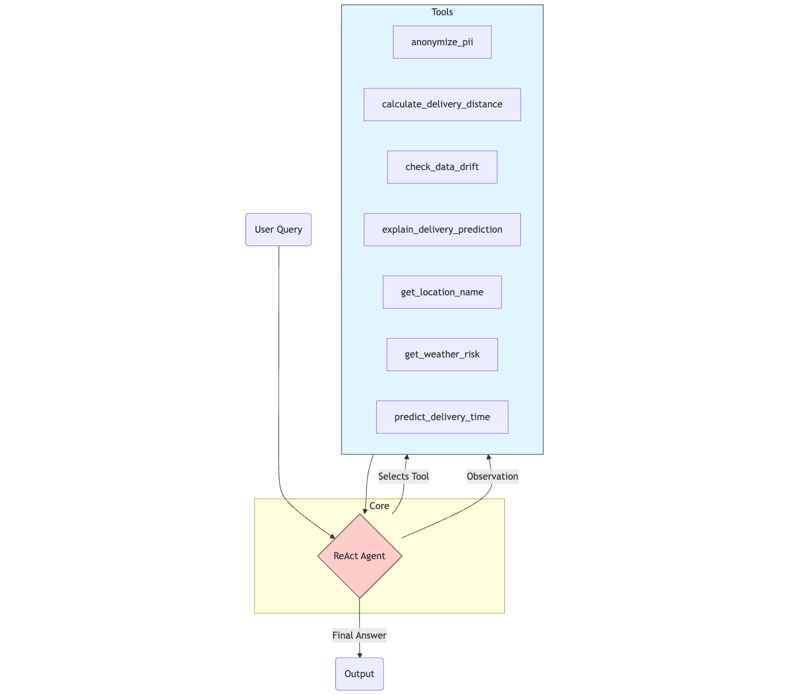
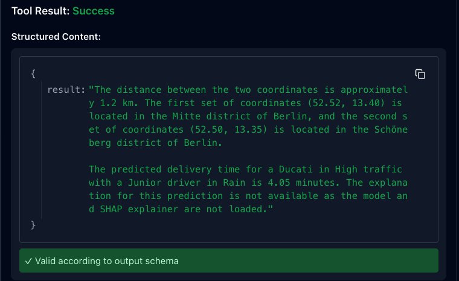

# Berlin Logistics AI Operative
### (Thanks to AI for cleaning up my description)

This project is a simulated system designed to optimize logistics operations in Berlin. It combines a reasoning agent with a machine learning to predict delivery times and ensure data compliance.

## Overview

The system uses a ReAct agent architecture (LangGraph) to process user queries. It can calculate distances, check weather conditions, predict delivery times using a trained Random Forest model, and explain its predictions using SHAP values. It also includes automated GDPR compliance for handling personal data and monitors for data drift.



## Key Features

1.  **Reasoning Agent**: An autonomous agent that selects the correct tools to answer complex queries about logistics.
2.  **Machine Learning Model**: A Random Forest Regressor trained on 250,000 synthetic delivery records to predict travel time based on vehicle type and weather.
3.  **Input Validation**: Strict type checking prevents invalid data (like incorrect vehicle types) from reaching the model.
4.  **Model Explainability**: The system explains why a specific prediction was made, showing the impact of factors like rain or vehicle choice.
5.  **Data Drift Detection**: Automatically alerts if new delivery data deviates significantly from the training baseline, signaling when the model needs retraining.
6.  **GDPR Compliance**: Automatically detects and masks personal identifiable information (PII) like names and emails in text.

## Tech Stack

*   **Language**: Python 3.11
*   **Agent Framework**: LangGraph
*   **Machine Learning**: Scikit-Learn, SHAP, Pandas
*   **Interface**: FastMCP (Model Context Protocol)

## Setup and Usage

### 1. Installation

Install the required dependencies:

```bash
conda create -n berlin_logistics python=3.11 -y
conda activate berlin_logistics
pip install -r requirements.txt
pip install "mcp[cli]"
```

### 2. Prepare Data and Model

First, generate the synthetic dataset and train the model. This step also saves the baseline statistics for drift detection.

```bash
python scripts/generate_data.py
python scripts/train.py
```

### 3. Run the Agent (Terminal Mode)

You can interact with the agent directly in your terminal to test its reasoning capabilities.

```bash
python scripts/agent.py
```

### 4. Run the Server (Production Mode)

To expose the agent as a tool for other applications, run the MCP server:

```bash
mcp dev scripts/server.py
```

## Example Queries

*   "Calculate distance between 52.52, 13.40 and 52.50, 13.35. Then predict the delivery time for a Bike if the weather is Rainy."
*   "Predict delivery time for a Bike in Berlin when it is Rainy. Then explain why the prediction is that number."
*   "Calculate distance between 52.52, 13.40 and 52.50, 13.35. Then predict the delivery time for a Bike if the weather is Sunny. How will the duration be changed if I had used a different vehicle?"
*   "The delivery times today were [90, 85, 95, 88, 92]. Check if there is data drift."
*   "Calculate distance between (52.52, 13.40) and (52.50, 13.35). Between which two areas in Berlin are these coordinates? Then predict delivery time for a Ducati in High traffic with a Junior driver in Rain. Explain the prediction."


